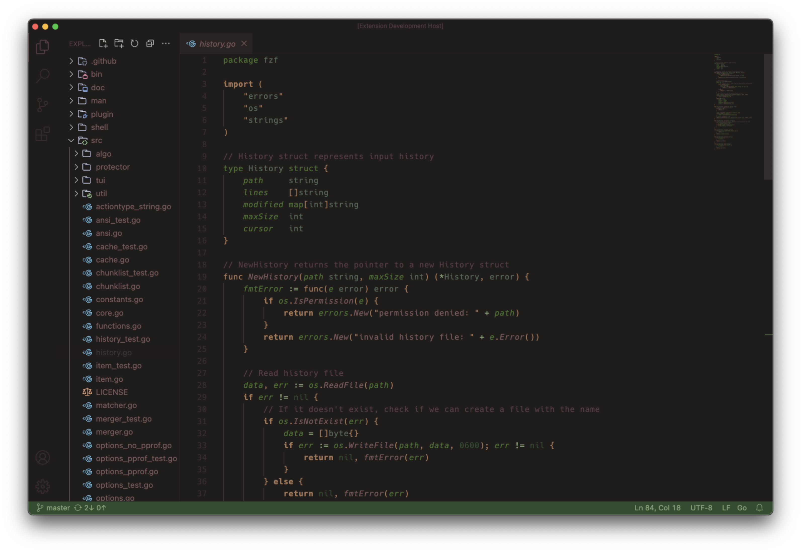

    <h3 align="center">🌲 Shinrin-yoku</h3>
    

        A dark VS Code theme inspired by the Japanese way of 'forest bathing.'
    

    

        
        <i>Font used: Hack<i>
    

## Palette

The palette is slightly modified from 31 found [here](https://lospec.com/palette-list/31).

## Usage

The theme can be installed from the VS Code extension marketplace [here](https://marketplace.visualstudio.com/items?itemName=williamfedele.shinrin-yoku). Alternatively, you can search for `Shinrin-yoku` within VSCode extensions.

## Disclaimer

This is my first VS Code theme and I haven't tested in many languages. If anything seems wrong, open an issue!

## License

Distributed under the MIT License. See `LICENSE` for more information.
